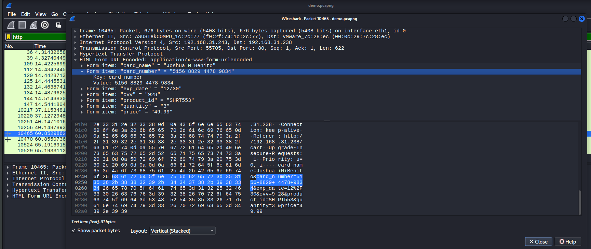
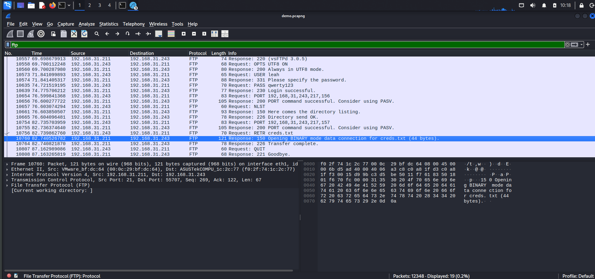
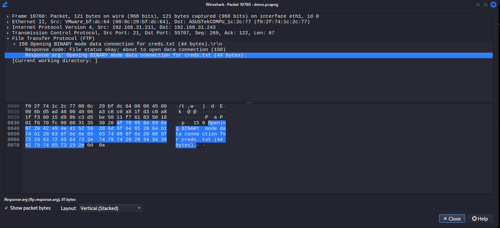

- The packet capture contains cleartext credit card information. What is the number that was transmitted?
	- **5156 8829 4478 9834**

Open the **demo.pcapng** file using `wireshark` and filter the packets using `http` and then look for the `POST` request to get the credit card number credentials.




- What is the SNMPv2 community string that was used?
	- **s3cr3tSNMPC0mmun1ty**

- What is the password of the user who logged into FTP?
	- **qwerty123**


```bash
$ ./Pcredz -f demo.pcapng -t -v
PCredz 2.1.0
Author: Laurent Gaffie
Contact: lgaffie@secorizon.com
X: @secorizon

CC number scanning activated

Parsing demo.pcapng...
[2026-09-21 10:30:38.124012] 192.168.31.243:55692 > 192.168.31.238:80
Potential password submission:
Request: username=jbenito&password=Password987%21

[2026-09-21 10:30:38.585815] 192.168.31.211:59022 > 192.168.31.238:161
Found SNMPv2c Community string: s3cr3tSNMPC0mmun1ty

[2026-09-21 10:30:38.586006] 192.168.31.211:59022 > 192.168.31.238:161
Found SNMPv2c Community string: s3cr3tSNMPC0mmun1ty

[2026-09-21 10:30:38.586099] 192.168.31.238:161 > 192.168.31.211:59022
Found SNMPv2c Community string: s3cr3tSNMPC0mmun1ty

[2026-09-21 10:30:38.586191] 192.168.31.211:59022 > 192.168.31.238:161
Found SNMPv2c Community string: s3cr3tSNMPC0mmun1ty

[2026-09-21 10:30:38.586272] 192.168.31.238:161 > 192.168.31.211:59022
Found SNMPv2c Community string: s3cr3tSNMPC0mmun1ty

[2026-09-21 10:30:38.586365] 192.168.31.211:59022 > 192.168.31.238:161
Found SNMPv2c Community string: s3cr3tSNMPC0mmun1ty

[2026-09-21 10:30:38.586446] 192.168.31.238:161 > 192.168.31.211:59022
Found SNMPv2c Community string: s3cr3tSNMPC0mmun1ty

[2026-09-21 10:30:38.586530] 192.168.31.211:59022 > 192.168.31.238:161
Found SNMPv2c Community string: s3cr3tSNMPC0mmun1ty

[2026-09-21 10:30:38.586600] 192.168.31.238:161 > 192.168.31.211:59022
Found SNMPv2c Community string: s3cr3tSNMPC0mmun1ty

[2026-09-21 10:30:38.586684] 192.168.31.211:59022 > 192.168.31.238:161
Found SNMPv2c Community string: s3cr3tSNMPC0mmun1ty

[2026-09-21 10:30:38.586765] 192.168.31.238:161 > 192.168.31.211:59022
Found SNMPv2c Community string: s3cr3tSNMPC0mmun1ty

[2026-09-21 10:30:38.586845] 192.168.31.211:59022 > 192.168.31.238:161
Found SNMPv2c Community string: s3cr3tSNMPC0mmun1ty

[2026-09-21 10:30:38.586922] 192.168.31.238:161 > 192.168.31.211:59022
Found SNMPv2c Community string: s3cr3tSNMPC0mmun1ty

[2026-09-21 10:30:38.586998] 192.168.31.211:59022 > 192.168.31.238:161
Found SNMPv2c Community string: s3cr3tSNMPC0mmun1ty

[2026-09-21 10:30:38.587075] 192.168.31.238:161 > 192.168.31.211:59022
Found SNMPv2c Community string: s3cr3tSNMPC0mmun1ty

[2026-09-21 10:30:38.587151] 192.168.31.211:59022 > 192.168.31.238:161
Found SNMPv2c Community string: s3cr3tSNMPC0mmun1ty

[2026-09-21 10:30:38.587227] 192.168.31.238:161 > 192.168.31.211:59022
Found SNMPv2c Community string: s3cr3tSNMPC0mmun1ty

[2026-09-21 10:30:38.587303] 192.168.31.211:59022 > 192.168.31.238:161
Found SNMPv2c Community string: s3cr3tSNMPC0mmun1ty

[2026-09-21 10:30:38.587380] 192.168.31.238:161 > 192.168.31.211:59022
Found SNMPv2c Community string: s3cr3tSNMPC0mmun1ty

[2026-09-21 10:30:38.587457] 192.168.31.211:59022 > 192.168.31.238:161
Found SNMPv2c Community string: s3cr3tSNMPC0mmun1ty

[2026-09-21 10:30:38.587534] 192.168.31.238:161 > 192.168.31.211:59022
Found SNMPv2c Community string: s3cr3tSNMPC0mmun1ty

[2026-09-21 10:30:38.587615] 192.168.31.211:59022 > 192.168.31.238:161
Found SNMPv2c Community string: s3cr3tSNMPC0mmun1ty

[2026-09-21 10:30:38.587692] 192.168.31.238:161 > 192.168.31.211:59022
Found SNMPv2c Community string: s3cr3tSNMPC0mmun1ty

[2026-09-21 10:30:38.587768] 192.168.31.211:59022 > 192.168.31.238:161
Found SNMPv2c Community string: s3cr3tSNMPC0mmun1ty

[2026-09-21 10:30:38.587845] 192.168.31.238:161 > 192.168.31.211:59022
Found SNMPv2c Community string: s3cr3tSNMPC0mmun1ty

[2026-09-21 10:30:38.587922] 192.168.31.211:59022 > 192.168.31.238:161
Found SNMPv2c Community string: s3cr3tSNMPC0mmun1ty

[2026-09-21 10:30:38.588001] 192.168.31.238:161 > 192.168.31.211:59022
Found SNMPv2c Community string: s3cr3tSNMPC0mmun1ty

[2026-09-21 10:30:38.588078] 192.168.31.211:59022 > 192.168.31.238:161
Found SNMPv2c Community string: s3cr3tSNMPC0mmun1ty

[2026-09-21 10:30:38.588155] 192.168.31.238:161 > 192.168.31.211:59022
Found SNMPv2c Community string: s3cr3tSNMPC0mmun1ty

[2026-09-21 10:30:38.588231] 192.168.31.211:59022 > 192.168.31.238:161
Found SNMPv2c Community string: s3cr3tSNMPC0mmun1ty

[2026-09-21 10:30:38.588310] 192.168.31.238:161 > 192.168.31.211:59022
Found SNMPv2c Community string: s3cr3tSNMPC0mmun1ty

[2026-09-21 10:30:38.588385] 192.168.31.211:59022 > 192.168.31.238:161
Found SNMPv2c Community string: s3cr3tSNMPC0mmun1ty

[2026-09-21 10:30:38.588461] 192.168.31.238:161 > 192.168.31.211:59022
Found SNMPv2c Community string: s3cr3tSNMPC0mmun1ty

[2026-09-21 10:30:38.588551] 192.168.31.211:59022 > 192.168.31.238:161
Found SNMPv2c Community string: s3cr3tSNMPC0mmun1ty

[2026-09-21 10:30:38.588632] 192.168.31.238:161 > 192.168.31.211:59022
Found SNMPv2c Community string: s3cr3tSNMPC0mmun1ty

[2026-09-21 10:30:38.588709] 192.168.31.211:59022 > 192.168.31.238:161
Found SNMPv2c Community string: s3cr3tSNMPC0mmun1ty

[2026-09-21 10:30:38.588792] 192.168.31.238:161 > 192.168.31.211:59022
Found SNMPv2c Community string: s3cr3tSNMPC0mmun1ty

[2026-09-21 10:30:38.588870] 192.168.31.211:59022 > 192.168.31.238:161
Found SNMPv2c Community string: s3cr3tSNMPC0mmun1ty

[2026-09-21 10:30:38.588949] 192.168.31.238:161 > 192.168.31.211:59022
Found SNMPv2c Community string: s3cr3tSNMPC0mmun1ty

[2026-09-21 10:30:38.589025] 192.168.31.211:59022 > 192.168.31.238:161
Found SNMPv2c Community string: s3cr3tSNMPC0mmun1ty

[2026-09-21 10:30:38.589119] 192.168.31.211:59022 > 192.168.31.238:161
Found SNMPv2c Community string: s3cr3tSNMPC0mmun1ty

[2026-09-21 10:30:38.589198] 192.168.31.238:161 > 192.168.31.211:59022
Found SNMPv2c Community string: s3cr3tSNMPC0mmun1ty

[2026-09-21 10:30:38.589274] 192.168.31.211:59022 > 192.168.31.238:161
Found SNMPv2c Community string: s3cr3tSNMPC0mmun1ty

[2026-09-21 10:30:38.589354] 192.168.31.238:161 > 192.168.31.211:59022
Found SNMPv2c Community string: s3cr3tSNMPC0mmun1ty

[2026-09-21 10:30:38.589430] 192.168.31.211:59022 > 192.168.31.238:161
Found SNMPv2c Community string: s3cr3tSNMPC0mmun1ty

[2026-09-21 10:30:38.589508] 192.168.31.238:161 > 192.168.31.211:59022
Found SNMPv2c Community string: s3cr3tSNMPC0mmun1ty

[2026-09-21 10:30:38.589584] 192.168.31.211:59022 > 192.168.31.238:161
Found SNMPv2c Community string: s3cr3tSNMPC0mmun1ty

[2026-09-21 10:30:38.589672] 192.168.31.238:161 > 192.168.31.211:59022
Found SNMPv2c Community string: s3cr3tSNMPC0mmun1ty

[2026-09-21 10:30:38.589748] 192.168.31.211:59022 > 192.168.31.238:161
Found SNMPv2c Community string: s3cr3tSNMPC0mmun1ty

[2026-09-21 10:30:38.589830] 192.168.31.238:161 > 192.168.31.211:59022
Found SNMPv2c Community string: s3cr3tSNMPC0mmun1ty

[2026-09-21 10:30:38.589907] 192.168.31.211:59022 > 192.168.31.238:161
Found SNMPv2c Community string: s3cr3tSNMPC0mmun1ty

[2026-09-21 10:30:38.589988] 192.168.31.238:161 > 192.168.31.211:59022
Found SNMPv2c Community string: s3cr3tSNMPC0mmun1ty

[2026-09-21 10:30:38.590066] 192.168.31.211:59022 > 192.168.31.238:161
Found SNMPv2c Community string: s3cr3tSNMPC0mmun1ty

[2026-09-21 10:30:38.590246] 192.168.31.238:161 > 192.168.31.211:59022
Found SNMPv2c Community string: s3cr3tSNMPC0mmun1ty

[2026-09-21 10:30:38.590344] 192.168.31.211:59022 > 192.168.31.238:161
Found SNMPv2c Community string: s3cr3tSNMPC0mmun1ty

[2026-09-21 10:30:38.590422] 192.168.31.238:161 > 192.168.31.211:59022
Found SNMPv2c Community string: s3cr3tSNMPC0mmun1ty

[2026-09-21 10:30:38.590498] 192.168.31.211:59022 > 192.168.31.238:161
Found SNMPv2c Community string: s3cr3tSNMPC0mmun1ty

[2026-09-21 10:30:38.590576] 192.168.31.238:161 > 192.168.31.211:59022
Found SNMPv2c Community string: s3cr3tSNMPC0mmun1ty

[2026-09-21 10:30:38.590656] 192.168.31.211:59022 > 192.168.31.238:161
Found SNMPv2c Community string: s3cr3tSNMPC0mmun1ty

[2026-09-21 10:30:38.590733] 192.168.31.238:161 > 192.168.31.211:59022
Found SNMPv2c Community string: s3cr3tSNMPC0mmun1ty

[2026-09-21 10:30:38.590808] 192.168.31.211:59022 > 192.168.31.238:161
Found SNMPv2c Community string: s3cr3tSNMPC0mmun1ty

[2026-09-21 10:30:38.590886] 192.168.31.238:161 > 192.168.31.211:59022
Found SNMPv2c Community string: s3cr3tSNMPC0mmun1ty

[2026-09-21 10:30:38.590967] 192.168.31.211:59022 > 192.168.31.238:161
Found SNMPv2c Community string: s3cr3tSNMPC0mmun1ty

[2026-09-21 10:30:38.591043] 192.168.31.238:161 > 192.168.31.211:59022
Found SNMPv2c Community string: s3cr3tSNMPC0mmun1ty

[2026-09-21 10:30:38.591120] 192.168.31.211:59022 > 192.168.31.238:161
Found SNMPv2c Community string: s3cr3tSNMPC0mmun1ty

[2026-09-21 10:30:38.591196] 192.168.31.238:161 > 192.168.31.211:59022
Found SNMPv2c Community string: s3cr3tSNMPC0mmun1ty

[2026-09-21 10:30:38.591282] 192.168.31.211:59022 > 192.168.31.238:161
Found SNMPv2c Community string: s3cr3tSNMPC0mmun1ty

[2026-09-21 10:30:38.591359] 192.168.31.238:161 > 192.168.31.211:59022
Found SNMPv2c Community string: s3cr3tSNMPC0mmun1ty

[2026-09-21 10:30:38.591435] 192.168.31.211:59022 > 192.168.31.238:161
Found SNMPv2c Community string: s3cr3tSNMPC0mmun1ty

[2026-09-21 10:30:38.591511] 192.168.31.238:161 > 192.168.31.211:59022
Found SNMPv2c Community string: s3cr3tSNMPC0mmun1ty

[2026-09-21 10:30:38.591588] 192.168.31.211:59022 > 192.168.31.238:161
Found SNMPv2c Community string: s3cr3tSNMPC0mmun1ty

[2026-09-21 10:30:38.591668] 192.168.31.238:161 > 192.168.31.211:59022
Found SNMPv2c Community string: s3cr3tSNMPC0mmun1ty

[2026-09-21 10:30:38.591744] 192.168.31.211:59022 > 192.168.31.238:161
Found SNMPv2c Community string: s3cr3tSNMPC0mmun1ty

[2026-09-21 10:30:38.591820] 192.168.31.238:161 > 192.168.31.211:59022
Found SNMPv2c Community string: s3cr3tSNMPC0mmun1ty

[2026-09-21 10:30:38.591896] 192.168.31.211:59022 > 192.168.31.238:161
Found SNMPv2c Community string: s3cr3tSNMPC0mmun1ty

[2026-09-21 10:30:38.591973] 192.168.31.238:161 > 192.168.31.211:59022
Found SNMPv2c Community string: s3cr3tSNMPC0mmun1ty

[2026-09-21 10:30:38.615406] 192.168.31.243:55707 > 192.168.31.211:21
FTP User: leah

[2026-09-21 10:30:38.616289] 192.168.31.243:55707 > 192.168.31.211:21
FTP Pass: qwerty123


demo.pcapng parsed in: 0.7023 seconds (12,348 packets, 15.5 MB).

```


- What file did the user download over FTP?
	- **creds.txt**


Use `ftp` to filter out the packets and then open the **BINARY DATA**. 



The file uploaded is **creds.txt**.



